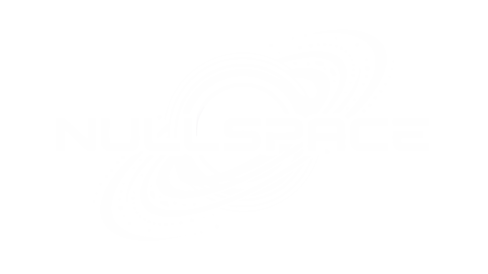

# NULLSPACE, a private server operating ultimateXnova

Busy working with le bugs, will update introduction when time.

## GRATIFYINGLY FIXED BY OVERWORKED MECHANICS AND SCHOLARS

- The search page is now operational in the nextgen theme.
- EN/INGAME English native translation.

## TO UNDERGO REPAIRS OR BE REVIEWED BY INFURIATING BUREAUCRATS

1. Lack of planet 'in km' specification on Overview. (nextgen)
2. Universe info tooltip stuck behind bar. (nextgen)
3. Administrator does not remain protected permanently if toggled. Possible admin tag instead of [N]?
4. Linking (to homepage/login) is still ultimatexnova (made changes to keywords but no change, review)
5. Italiano (and maybe other languages) is a hot mess of syntax errors owing to the language employing ' a lot.
6. Ascertain if news is operating normally, and where it appears.

## HIGH PRIORITY, i.e. MAJOR BREAKAGES/HULL BREACHES

1. Clicking on user in galaxy view results in tooltip which remains permanent

## About ultimateXnova

ultimateXnova is an open-source browser-based space exploration and conquest game. It provides a platform for players to build and manage their own interstellar empires, engage in diplomacy and warfare with other players, and explore the vastness of space.

## Credits

Pfahli (ultimateXnova) (repository this was forked from)
koraykarakus (SteemNova)
IntinteDAO (SteemNova)
mys (SteemNova)
Jan (2Moons)
